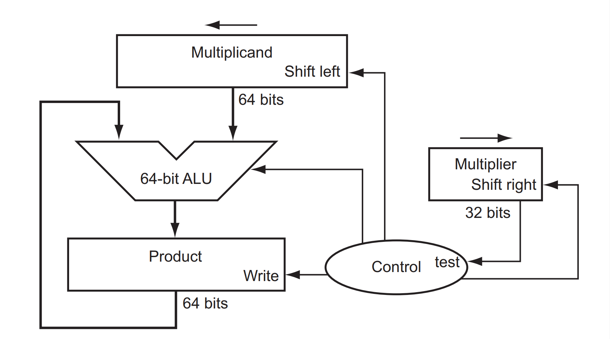

# Multiplicador Multiciclo

Multiplicadores digitais são circuitos responsáveis por realizar a operação de multiplicação entre dois números binários. Eles são úteis em diversas áreas como Processamento Digital de Sinais, Computação Gráfica, Criptografia, Machine Learning, entre outras.

De forma geral, existem dois tipos principais de multiplicadores digitais: os **combinacionais** e os **sequenciais (multiciclo)**.

- **Multiplicadores combinacionais** realizam a operação em um único ciclo de clock, porém consomem uma área consideravelmente maior no circuito.
- **Multiplicadores multiciclo** operam em múltiplos ciclos, levando até *N* ciclos, onde *N* é o número de bits do menor operando. Por exemplo, multiplicar dois números de 6 e 4 bits pode levar até 4 ciclos. A vantagem é que esse tipo de implementação consome muito menos área.

Nesta atividade, você deverá implementar um módulo em **Verilog** que realiza uma multiplicação sem sinal (unsigned) de forma **multiciclo**.

---

## O Multiplicador

Um multiplicador multiciclo é, basicamente, um circuito que realiza somas sucessivas combinadas com operações de deslocamento. O diagrama abaixo ilustra sua estrutura:



O circuito é composto por cinco blocos principais:
1. Registrador do multiplicando
2. Registrador do multiplicador
3. Somador
4. Acumulador (registrador do produto)
5. Unidade de controle (responsável por coordenar os ciclos, somas e shifts)

---

### Como funciona a multiplicação

A lógica do multiplicador multiciclo parte da seguinte ideia:

Dado dois números A e B, a multiplicação `R = A * B` pode ser construída somando múltiplos deslocados de A, dependendo dos bits de B. Por exemplo:

Se A = `1110` (14) e B = `1011` (11), temos:  
`R = A * (B[0]*1 + B[1]*2 + B[2]*4 + B[3]*8)`

Ou seja:  
`R = A*1 + A*2 + A*0 + A*8 = A*(1 + 2 + 8) = A*11`

Como multiplicações por potências de dois podem ser substituídas por deslocamentos, podemos aplicar o seguinte algoritmo:

1. Carregue os valores de A e B
2. Se `B[0] == 1`, adicione A ao acumulador
3. Desloque A para a esquerda (`A <<= 1`)
4. Desloque B para a direita (`B >>= 1`)
5. Repita pelos N bits do multiplicador ou até o mesmo ser igual a 0

---

### Sinais e parâmetros

O módulo recebe como parâmetro `N`, que representa o número de bits das entradas. A saída terá `2N` bits.

Entradas:
- `clk`: clock
- `rst_n`: reset síncrono, ativo em nível lógico baixo
- `start`: sinal que indica início da operação
- `multiplier`: valor do multiplicador (N bits)
- `multiplicand`: valor do multiplicando (N bits)

Saídas:
- `product`: resultado da multiplicação (`2N` bits)
- `ready`: sinal que indica que a operação foi concluída (deve ser 1 por **apenas um** ciclo de clock)

---

## Atividade

Implemente o módulo `Multiplier` em **Verilog**. Use o seguinte template como ponto de partida:

```verilog
module Multiplier #(
    parameter N = 4
) (
    input wire clk,
    input wire rst_n,

    input wire start,
    output reg ready,

    input wire   [N-1:0] multiplier,
    input wire   [N-1:0] multiplicand,
    output reg [2*N-1:0] product
);
    // Insira seu código aqui
endmodule
```


## Execução da atividade

Siga o modelo de módulo já fornecido e utilize o testbench e scripts de execução para sua verificação. Em seguida, implemente o circuito de acordo com as especificações e, se necessário, crie outros testes para verificá-lo.

Uma vez que estiver satisfeito com o seu código, execute o script de testes com `./run-all.sh`. Ele mostrará na tela `ERRO` em caso de falha ou `OK` em caso de sucesso.

## Entrega

Realize um *commit* no repositório do **GitHub Classroom**. O sistema de correção automática irá validar sua implementação e atribuir uma nota com base nos testes.

> **Dica:**  
Não altere os arquivos de correção! Para entender como os testes funcionam, consulte o script `run.sh` disponível no repositório.
